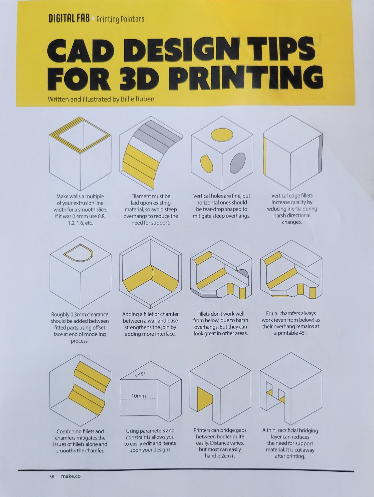
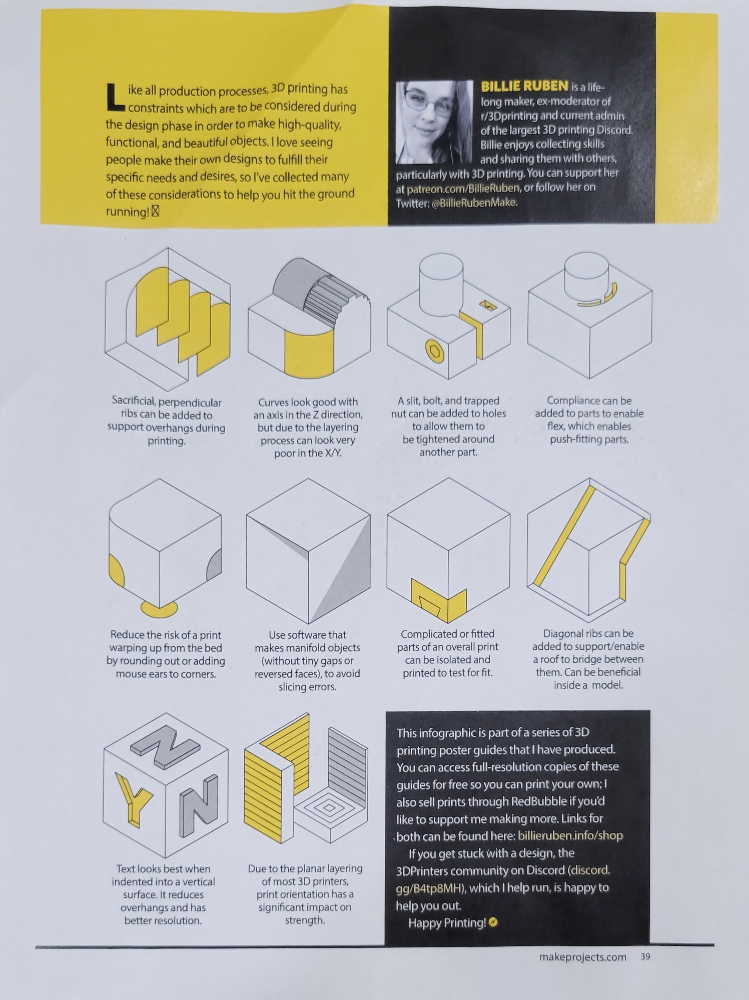

# Medical-Device-Design
This repository is meant to serve as an easy collection of documents that can help with designing medical devices, or devices more broadly as a whole.  The guidance here is not complete or total, and should not be favored over the guidance of the FDA, but can help with making functional prototypes in the design process.
This repository will contain some basic info for designing medical devices (and some helpful info for device design in general).

## Who is this for?
This repository is designed to help students, instructors, and experienced designers from other fields quickly get a grasp on device design. While there will be some in-depth information included here, the primary goal of this repository is to serve as a springboard into designing devices.
## 3D PRINTING AND 3D MODELING
The quality of any 3D Print is fundamentally dependent on two things: The state of the 3D-printer and the quality of the 3D model printed. While 3D-printing does provide an incredibly fast and easy method of prototyping, the limitations of additive manufacturing itself do mean that 3D-modelling in a cad environment has to be done with care. Designing parts for 3D-printing, like with any other manufacturing process, has it's own specific requirements, i.e. 3D-printers cannot make everything. Attached Below is an image showing a number of important considerations that standard FDM printing has, and how to implement those considerations into CAD models.

 Most of these details are obvious after reading about them, and can be learned intuitively over time, but being able to properly articulate and define the points that need extra-care in design for 3D-printing is difficult, and so I give a great deal of praise and credit to the creator of the infographic, Billie Ruben. For more exellent 3D-printing wisdom, you can follow and support Billie at her [Patreon](patreon.com/BillieRuben), or find her other work [here](https://linktr.ee/BillieRuben).

## ELECTRONICS
Working with electronics can be difficult if you don't know where to start, so, to provide a basic starting point, I've provided a number of links to sources that can help with gaining a basic understanding of electronics and electricity. Before you use any of those links, however, you should know that the most important thing in learning how to design low-power electronics is to actually make the electronics. There is no better way to learn electronics than to actually make them. I would recommend testing your skills regularly while learning, and not being afraid of working with circuits.

### IMPORTANT SAFETY NOTE:
Sometimes, you should be afraid of working with circuits. The right amount of fear is the amount of fear that keeps you following the best practices to building circuits safely. Electricity can be dangerous across a wide range of voltages, currents, and frequencies, and not taking proper care can result in injury or death. For basic low-power work, staying safe can be as simple as wearing rubber-soled shoes and safety glasses, and only working with unpowered and discharged circuitry. For more complicated applications, staying safe requires proportionally complicated precautions. This is not meant to be a complete guide to safety, and nothing said here should be taken as an adequate replacement for the safety advice given by the experts in the field. This includes safety advice such as that found in the [IEEE National Electrical Safety Code](https://store.accuristech.com/standards/ieee-c2-2023?product_id=2254672) (~$230 as of writing), the [OSHA Electrical Safety Standards](https://www.osha.gov/electrical) (The bare-minimum to be safe. Further precautions are advised), or your local safety professionals, such as your local fire department or a local licensed electrician.

### RESOURCES:
+ [An extremely basic online circuit simulator. If you want to test basic circuits, this will help.](https://phet.colorado.edu/sims/html/circuit-construction-kit-dc/latest/circuit-construction-kit-dc_en.html)
+ [A more complicated but also more powerful circuit simulator](https://www.circuitlab.com/)
+ [A free and in-depth guide to the fundamentals underlying electronics](https://www.learningelectronics.net/)
+ kahn Academy also has an [excellent course](https://en.khanacademy.org/science/electrical-engineering) on Electrical Engineering fundamentals, which I can personally attest is a great course for those who want to design **low-power** devices **and** get an understanding of the fundamentals of electricity.

## BASIC QUESTIONS FOR MAKING BETTER PROTOTYPES###
When making functional prototypes, knowing what questions to ask can be difficult. This list is meant to help avoid that:

1. Who is the device for? Be as specific as possible.
2. What is the intended use of the device?
  - What is the intended use environment?
3. What are the Inputs?
  1. How are the Inputs collected?
    1. If inputs are taken via sensor, what are the measured variables?
    2. If inputs are taken directly, via keyboard or code, what are the input options?
  2. How do you make sure the values are valid?
4. What processing steps are being taken before the device outputs?
  - How are these steps being done?
5. What are the outputs?
    1. How can I see the output data?
    2. How can the end-user see the output data?
       - Is the output data able to be interpreted easily by the average person?
    3. How stimulating is the output?
       1. Is the data overstimulating (end users ignore it)?
       2. Is the data understimulating (end users miss it)?
6. Is the device safe?
   1. How can the device be re-designed for improved safety?
   2. Is the device biocompatible for the intended use environment?
7. Is the design manufacturable?
8. Is the design economical?
9. How can the same *input -> processing -> output* process be done more simply?

These questions are not complete, but they should help with producing better devices in general. More questions will likely come-up during the device design process, and should be accounted for as necessary.
